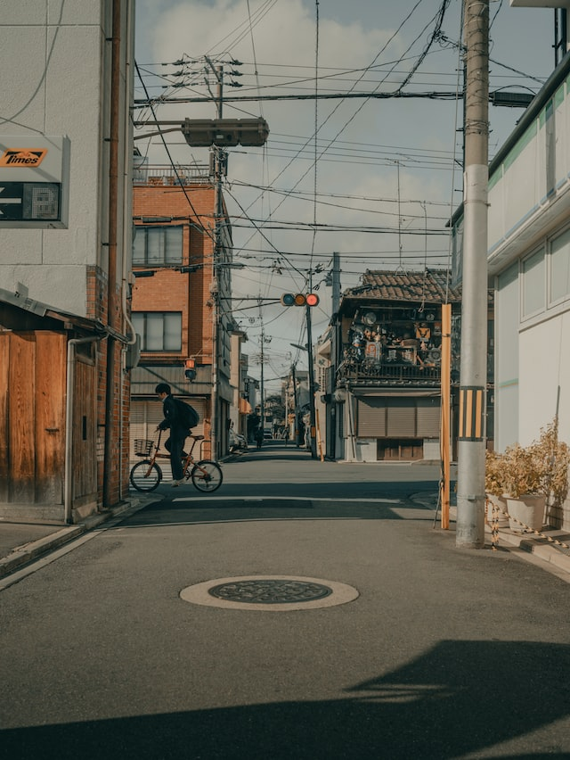
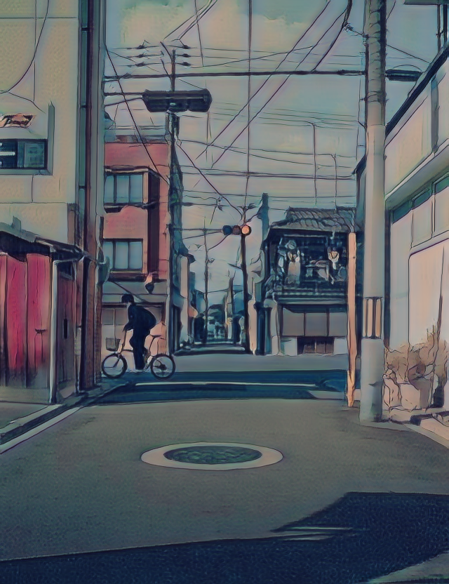
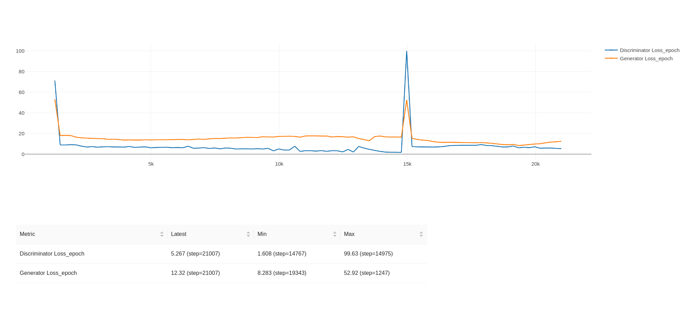

# **AnimeME: Apply anime styles to your photos using GANs**
***

Pytorch implementation of AnimeGAN for fast photo animation.
* *AnimeGAN: a novel lightweight GAN for photo animation* - [Semantic scholar](https://www.semanticscholar.org/paper/AnimeGAN%3A-A-Novel-Lightweight-GAN-for-Photo-Chen-Liu/10a9c5d183e7e7df51db8bfa366bc862262b37d7#citing-papers)

***
## **Documentation**

### Folder Structure
* **src**: Training Code
* **gradio_app**: code for the app deployed on huggingface-spaces
* **lightning_backend**: code for the lightning app backend deployed on lightning-cloud.

### **1. Install required dependencies**

* Create virtual environment in python.
* Install dependencies using the following command
```bash
pip install -r requirements.txt
```

### **2. Prepare dataset**

* Download the dataset from [AnimeGANV2 repo](https://github.com/TachibanaYoshino/AnimeGANv2)
* Extract the dataset to the desired folder. Run the below command if there are no smooth images in your style folder i.e Hayao, Paprika, etc

```bash
python src/data_process --data_dir <Path to the stored location of dataset> --dataset <The name of the style data i.e Hayao/Paprika/Shenkai> --image-size 256
```


### **3. Train animeGAN**

* To train the animeGAN from command line, you can run `train_model.py` as the following:
* You can play around the parameters in params.yaml file avaiable in ```Params``` folder.

```bash
python src/train_model.py
```

### **3. Transform images**

To convert images in a folder or single image, run `inference_image.py`, for example:

> --src and --dest can be a path to file : "./images/fake.png" or something like this.

```bash
python src/infer.py --checkpoint_path <path to saved checkpoint> --source_path <path to src image> --dest_path <path to where image should be saved>
```

### **4. Run lightning app on local system**

To run lightning app on your local system follow the below instructions

* Navigate to ```lightning_backend``` folder and install the requirements.
* Run the below command to run the app.

``` lightning run app app.py```

* This will open up  for the app. 

* If you want to use the backend which I have deployed use the below command to curl for results
```
curl -X 'POST' \
  'https://mhwgp-01gjvacrnf5yhhtdeebd0bhw3t.litng-ai-03.litng.ai/api/predict' \
  -H 'accept: application/json' \
  -H 'Content-Type: multipart/form-data' \
  -F 'data=<Path to your file>'
```

**Note: I cannot guarantee how much time this API will be hosted as it may cost me later down the line.**

## Anime transformation results


| Input | Output(Hayao style) |
|--|--|
|||
|||
|||
|||
|||
|||

## Training Curves
Below is how my loss looked like for overall training. All the tracking is done using ML-Flow.



**Note : Batch size will has significant effect on training and results. Atleasts that's what I observed.**

## Things to remember
* You can train this on any dataset but images should be high resolution especially the style images.
* Read the paper to understand the implementation and process.
* It is very important to track your experiments, I used [mlflow](https://mlflow.org/) to track my experiment and parameters.


## Work in Progress
- [ ] TensorRT/Onnx models.
